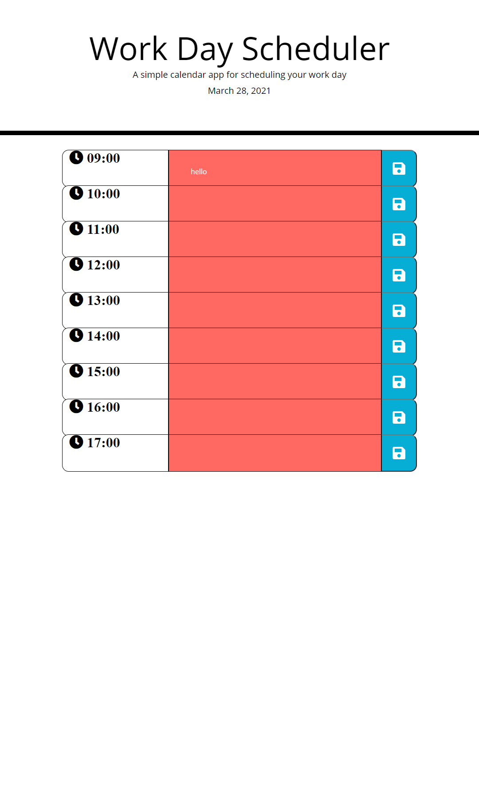

# Work Day Scheduler 
## User story 
AS AN employee with a busy schedule
I WANT to add important events to a daily planner
SO THAT I can manage my time effectivelyrity

## User Criteria 
GIVEN I am using a daily planner to create a schedule
WHEN I open the planner
THEN the current day is displayed at the top of the calendar
WHEN I scroll down
THEN I am presented with time blocks for standard business hours
WHEN I view the time blocks for that day
THEN each time block is color-coded to indicate whether it is in the past, present, or future
WHEN I click into a time block
THEN I can enter an event
WHEN I click the save button for that time block
THEN the text for that event is saved in local storage
WHEN I refresh the page
THEN the saved events persist

## How to use 
Timeblocks are colour coded to update based on current time, blocks in the future are green, blocks in the past are greyed out and the current time block is red. 
Each timeblock is editable and will retain information on page refesh (this functionality is not completed) 

## Image of Webiste 

## Website location 
website can be viewed at 

## Github Repository 
Github Repository can be viewed at 
https://fraudwheeldrive.github.io/work-day-scheduler/

##  Built With 
Password Generator is built with:
*HTML
*CSS
*Javascript
## Contribution 
HTML and CSS Styling provided by U of T SCS Coding bootcamp, 
use of the following CDN's
https://fontawesome.com/
https://momentjs.com/
https://getbootstrap.com/
https://jquery.com/

Javascript code done by Andrew core 

## References 

#### © 2021 Fraudwheeldrive, Inc.
